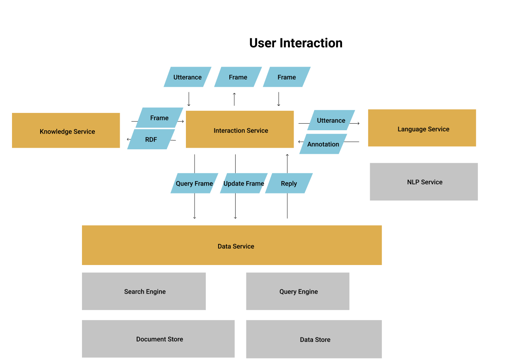
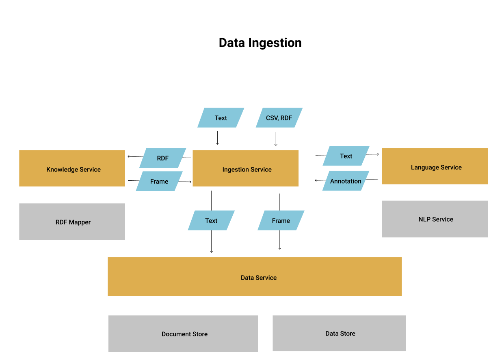

# KnowledgeGraph
Isagog Knowledge Graph service API specification

The Isagog platform for Knowledge Graphs consists in the following modules:

- [knowledge](spec/kg-knowledge.yaml): knowledge representation structures with their access and manipulation methods
- [data](spec/kg-data.yaml): data items with manipulation, search and query methods
- [language](spec/kg-language.yaml): natural language processing methods
- [interaction](spec/kg-interact.yaml): user interaction methods
- [ingestion](spec/kg-ingest.yaml): data ingestion methods

Each module features a specific root path, so the corresponding services may share the same communication port.
The client code, as well as a variety of server stubs, can be generated by [openapi tools](https://github.com/OpenAPITools/openapi-generator).

Here is a high-level picture of the platform's architecture, as it unfolds in the two main use cases:

This picture shows how a user utterance should be processed, and is indeed processed in the reference implementation.
1. The utterance (raw text) is received by the interaction service and, if it is worth processing, is sent to the language service.
2. The language service responds with an annotation structure, or a rebuttal message.
3. The interaction service sends the annotated sentence to the knowledge service, which tries to build a conceptual frame upon it.
4. Based on its type, i.e. Query or Update, the frame is dispatched to the data service.
5. The data service result flows to the interaction service and then to the user.

Here is a sketch of the data ingestion, i.e. texts such as documents or mails, or rdf files previously prepared.
1. The ingestion service discriminates the file type; texts are sent to the language service for content analysis.
2. The ingestion service pulls the textual content in the document store, and possibly the extracted triples in the data store.

 

