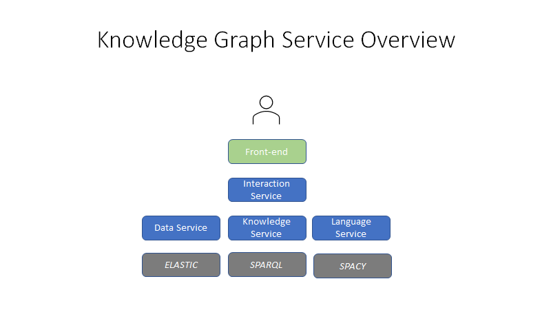

# KnowledgeGraph
Isagog Knowledge Graph service API specification

The Isagog platform for Knowledge Graphs consists in the following logical modules:

- [interaction](spec/kg-interact.yaml): user interaction interfaces
- [knowledge](spec/kg-knowledge.yaml): concept-level methods and structures
- [language](spec/kg-language.yaml): natural language processing methods and structures
- [data](spec/kg-data.yaml): instance-level manipulation, search and query methods


Each module is tagged and features a specific root path.

To generate the client API, move to the directory [java-client](java-client) and use the supplied [maven pom file](java-client/pom.xml).
```
mvn [package | install] 

```

To generate the server stub, move to the directory [java-server](java-server) and use the supplied [maven pom file](java-server/pom.xml) 

```
mvn [package | install] 

```

Code generation can be configured generate any supplementary resource, refer to [openapi tools](https://github.com/OpenAPITools/openapi-generator) for details.


Here is a high-level sketch of the platform's architecture:



Service's functionalities are provided by 3 micro-services:

1. Data Service: CRUD and QUERY operations on the data layer
2. Knowledge Service: QUERY operations on the data conceptual schema (ontologies)
3. Language Service: NLP wrapper (document-level and sentence-level analysis)

For interactive use cases (e.g. query answering), the front-end uses a 
4. Interaction Service: Supports dynamic query building with autocomplete 


